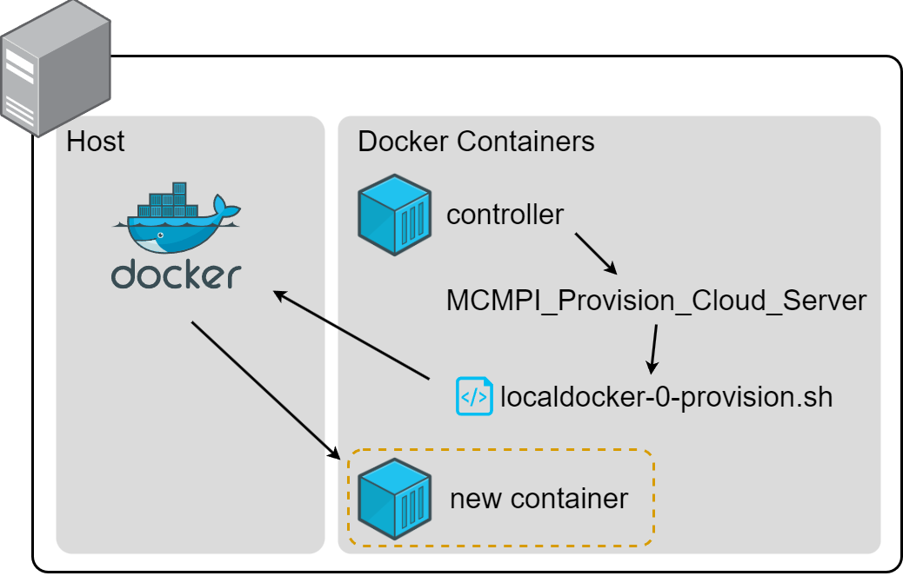

# Introduction

The MCMPI library (Multi Cloud/Cluster MPI) is an extension over the MPI standard that allows the user to to utilize resources allocated in different domains as shown in the Figure below.


In order to use, the user can:

1. List all the servers in a `mcmpi_hostfile` which is used by MCMPI to create an execution layer. This options doesn't require recompiling of the original source code since we're leveraging LD_PRELOAD mechanism.
2. Dynamically add/provision/remove (cloud) new nodes/mpi processes to the application by using the functions: `MCMPI_Add_Node`, `MCMPI_Add_Cluster`, `MCMPI_Provision_Cloud_Server` and `MCMPI_Remove_Rank`.

Under the hood, the library abstracts the multi domain network topology to the user's application.

# Install

## Manually

```bash
cd src
mpicc -shared -fPIC -I./ preload.c -o preload.so -ldl -lpthread
# use preload.so as LD_PRELOAD=./path-to-preload.so in local development
```

## From Releases

Download `.rpm` from Releases

or install directly from the link

`yum -y install https://git.raw.package.rpm`

# Local Build Development

```bash
git clone https://github.com/CrashLaker/mcmpi-hpc.git
cd mcmpi-hpc
mpicc -shared -fPIC -I./ preload.c -o preload.so -ldl -lpthread
```

# How to run examples

## Example 01. localdocker-elastic

Pre-requisites:
* Any linux (Amazon Linux, Ubuntu, CentOS, Debian)
* Docker



```bash
git clone repo
cd repo/examples/01-test-localdocker-elastic/docker
docker-compose up -d # to spin up container infrastructure
./login
cd /code/repo/examples/01-test-localdocker-elastic
./cmd
```

# Versioning

https://semver.org/ MAJOR.MINOR.PATCH

Major: Incompatible API changes
Minor: Added functionality in a backwards-compatible manner
Patch: Backwards compatible fixes (such as bug fixes)

# Publications

* 19/10/2022: [MPI: uma biblioteca com elasticidade para ambientes com múltiplos domínios e nuvem pública](https://sol.sbc.org.br/index.php/wscad/article/view/21929)

# Contributors

Polytechnic School of the University of Sao Paulo - Brazil

<table>
        <td>
            Carlos Aguni
        </td>
        <td>
            
        </td>
    </tr>
    <tr>
        <td>
            Liria Matsumoto Sato 
        </td>
        <td>
            
        </td>
    </tr>
</table>

<table>
    <tr>
        <td>
            
        </td>
        <td>
            
        </td>
    </tr>
</table>

 
